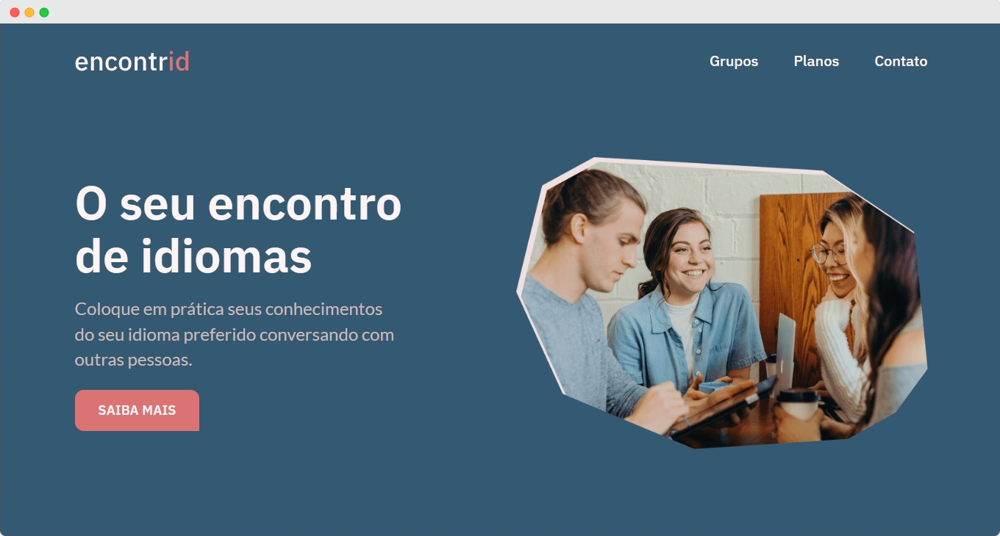

<h1 align="center" style="font-weight: bold;">Encontrid 💻</h1>

<p align="center">
    <a href="#layout">Layout</a> • 
    <a href="#tech">Technologies</a> • 
    <a href="#started">Getting Started</a>
</p>

<p align="center">
    <b>Website of a fictional language school.</b>
</p>

<p align="center">
     <a href="https://luizfbn.github.io/encontrid/">📱 Visit this Project</a>
</p>

<h2 id="layout">🎨 Layout</h2>

<p align="center">
    
</p>

<h2 id="tech">💻 Technologies</h2>

- Javascript
- HTML
- CSS

<h2 id="started">🚀 Getting started</h2>

<h3>Prerequisites</h3>

- [Git](https://git-scm.com/downloads)

<h3>Cloning</h3>

```bash
git clone https://github.com/luizfbn/encontrid.git
```

<h3>Starting</h3>

```bash
cd encontrid
```

Use a local server to host the project.

- If you use VSCode, you can use the [Live Server](https://marketplace.visualstudio.com/items/?itemName=ritwickdey.LiveServer) extension.
